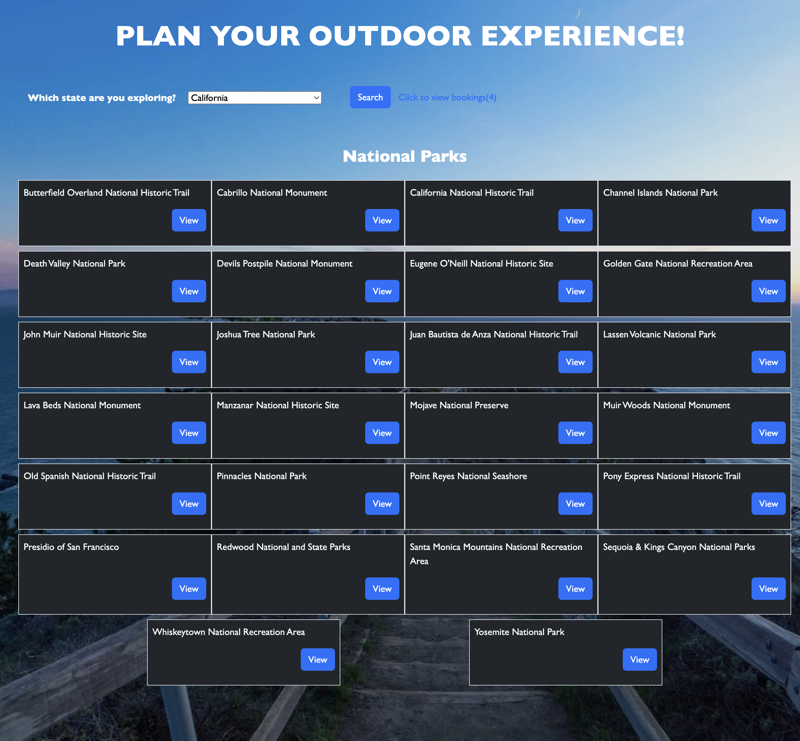
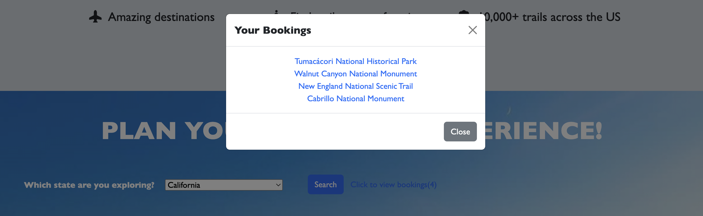
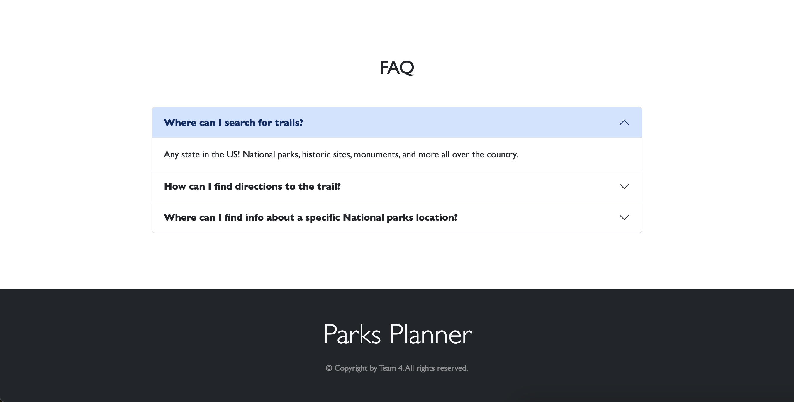

# Parks Planner

## Table of Contents

* [Description](#description)
* [Usage](#usage)
* [Requirements](#requirements)
* [Technologies Used](#technologies-used)
* [Third Party APIs](#third-party-apis)
* [Contributors](#contributors)
* [License](#license)

## Description
The National Parks Planner is a server-side API driven web app to provide users with a list of national parks of a selected state and trails in the the selected area.

Utilization of local storage allows users to create a personal account and track which parks they would like to visit.

Future development of this app would include expansion of the personal account, allowing a user to store information on parks they would like to visit and plan an itinerary for that park.

## Usage
Upon opening the [Parks Planner](https://adamh1223.github.io/group4-class-project-1/), the user is presented with an introduction to the page. Clicking the "Try It Out" link on the upper right of the page directs the user to the search form where they may select a U.S. state. Clicking the "Search" button generates a list of national parks within the selected state, links to the official page of the respective park, and trails in/near that park.

## Requirements

To operate the National Park Planner, a user must have a browser that supports JavaScript and has it enabled.

## Technologies Used

Built with:
* HTML5
* Advanced CSS
* JavaScript
* [jQuery](https://jquery.com/)
* [Bootstrap](https://getbootstrap.com/)

## Third Party APIs

* [National Park Service](https://developer.nps.gov/api/v1/)
* [Trail API](https://trailapi-trailapi.p.rapidapi.com)
* [jQuery](https://code.jquery.com/jquery-3.4.1.min.js)
* [Bootstrap](https://cdn.jsdelivr.net/npm/bootstrap@5.1.3/dist/css/bootstrap.min.css)
* [Google Fonts](https://fonts.googleapis.com)

## Contributors
* Jenina dela Cruz
* Porsche Herskorn
* Adam Hussain
* David Nosach
* Romy Pisigan
* Richard Thomas

## Link to Application
https://adamh1223.github.io/parks-planner/

## Link to GitHub Repository
https://github.com/adamh1223/parks-planner

### 
[Back to Top](#parks-planner)
 
